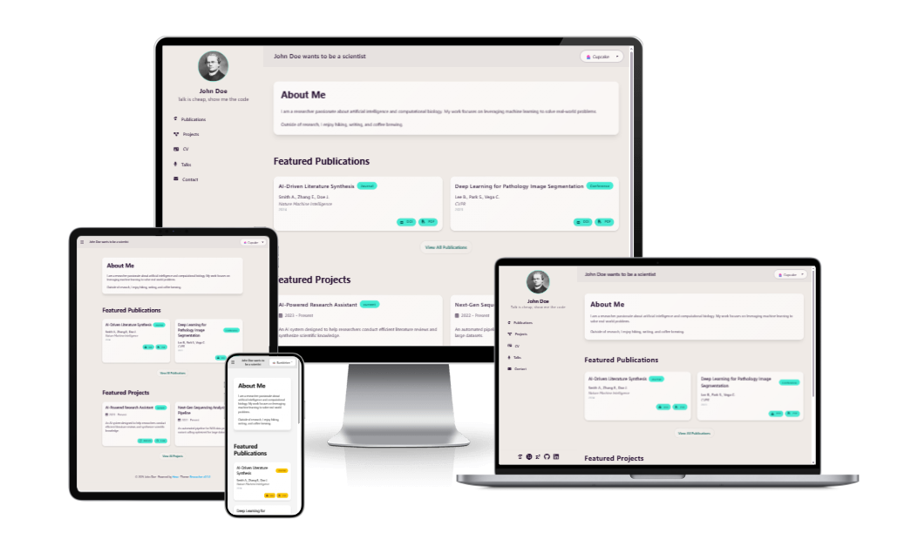

# Hexo Theme Researcher

A modern, responsive, and professional academic portfolio theme for researchers, built with Tailwind CSS, and DaisyUI.



## Design Philosophy

The Researcher theme is designed with the following principles in mind:

- **Professional & Clean**: A minimalist design that puts your academic work in the spotlight
- **Modern & Responsive**: Built with the latest web technologies for optimal viewing on all devices
- **Accessible & Fast**: Optimized for performance and accessibility
- **Customizable**: Easy to personalize with your own colors, fonts, and content
- **Academic-Focused**: Specialized features for showcasing publications, projects, and academic achievements

## Features

- 📱 Fully responsive design
- 🎨 Multiple theme options
- 📊 Project showcase with detailed descriptions
- 📝 CV/Resume page with download option
- 🎤 Talks and presentations section
- 🔗 Academic profile links (Google Scholar, ORCID, ResearchGate)

## Installation

1. Install Hexo:
```bash
npm install -g hexo-cli
```

2. Create a new Hexo site:
```bash
hexo init my-site
cd my-site
```

3. Install the theme:
```bash
git clone https://github.com/yourusername/hexo-theme-researcher themes/hexo-theme-researcher
```

4. Install dependencies:
```bash
npm install
```

5. Configure your site by editing `_config.yml` in your site's root directory:
```yaml
theme: hexo-theme-researcher
```

## Configuration

Edit `_config.yml` in the theme directory to customize your site:

```yaml
# Basic Information
title: Your Name
subtitle: Your Title
description: Your research description
avatar: /images/avatar.jpg

# Menu Configuration
menu:
  - name: Publications
    url: /publications/
    icon: ai ai-google-scholar
  - name: Projects
    url: /projects/
    icon: fas fa-project-diagram
  - name: Talks
    url: /talks/
    icon: fas fa-chalkboard-teacher
  - name: CV
    url: /cv/
    icon: fas fa-file-alt
  - name: Contact
    url: /contact/
    icon: fas fa-envelope

# Check other sections in the _config.yml file
```

## Create Required Pages

Before using the theme, you need to create the following pages:

```bash
hexo new page publications
hexo new page projects
hexo new page talks
hexo new page cv
hexo new page contact
```

After creating each page, you need to set the correct layout in the front-matter of each page's markdown file. For example, for the publications page:

```yaml
---
title: Publications
date: 2024-01-01
layout: publications
---
```

Similarly, set the layout for other pages to match their names (e.g., `layout: projects` for projects page, `layout: talks` for talks page, etc.).

## Data Files

Create the following data files in your site's `source/_data` directory. You can find example data in the theme's `demo_data` folder:

- `publications.yml`: Your academic publications
- `projects.yml`: Research projects
- `talks.yml`: Presentations and talks
- `cv.yml`: Your CV/resume information

## Development

1. Install development dependencies:
```bash
npm install
```

2. Start the development server:
```bash
hexo server
```

3. Build the site:
```bash
hexo generate
```

## License

This theme is released under the MIT License. See the [LICENSE](LICENSE) file for details.

## Credits

- [Hexo](https://hexo.io/)
- [Tailwind CSS](https://tailwindcss.com/)
- [DaisyUI](https://daisyui.com/)
- [Academic Icons](https://jpswalsh.github.io/academicons/)
- [Font Awesome](https://fontawesome.com/)

## Contributors

[](https://github.com/jiehua1995/hexo-theme-researcher/graphs/contributors)

---

Made with ❤️ for the academic community 